<div align="center">

```
██╗     ███████╗████████╗██╗  ██╗███████╗      ██╗  ██╗
██║     ██╔════╝╚══██╔══╝██║  ██║██╔════╝      ██║ ██╔╝
██║     █████╗     ██║   ███████║█████╗        █████╔╝ 
██║     ██╔══╝     ██║   ██╔══██║██╔══╝        ██╔═██╗ 
███████╗███████╗   ██║   ██║  ██║███████╗      ██║  ██╗
╚══════╝╚══════╝   ╚═╝   ╚═╝  ╚═╝╚══════╝      ╚═╝  ╚═╝
```

**Pentest Secrets Manager**


*Local · Encrypted · Kill Switch · Zero cloud dependency*

</div>

---

## Overview

During a pentest, sensitive data accumulates fast: compromised credentials, session tokens, password hashes, SSH private keys, database access strings. That information usually ends up scattered across text files, terminal history, and memory. Lethe-K is the encrypted vault where all of it lives, organized by engagement, protected by AES-256-GCM, and capable of disappearing without a trace when necessary.

The name comes from Greek mythology. Lethe is the river of oblivion — souls who drank from its waters forgot everything, erasing all trace of their existence. The K references both *keys* (what it stores) and *kill switch* (the mechanism that can destroy everything irreversibly on demand).

Lethe-K is not a general-purpose password manager. It is built specifically for the pentesting workflow: engagement-based organization, nine pentest-specific secret types, a four-level destruction system, and an immutable audit log. Everything local, everything encrypted, nothing in the cloud.

> **Scope:** This repository is a documented showcase. Source code is private.

---

╭──────────────────────────────╮
│ ● ● ●                        │
├──────────────────────────────┤
│                              │
│     ## Screenshot            │
│                              │
╰──────────────────────────────╯

        Dashboard

<details>
<summary>📸 View screenshots (11)</summary>

<br>

<table>
<tr>
<td width="50%" align="center">

<a href="assets/login.png">
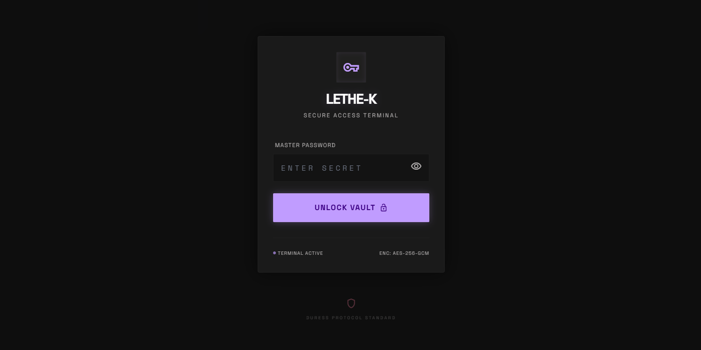
</a>

<br>
<b>Login</b>

</td>

<td width="50%" align="center">

<a href="assets/overview.png">
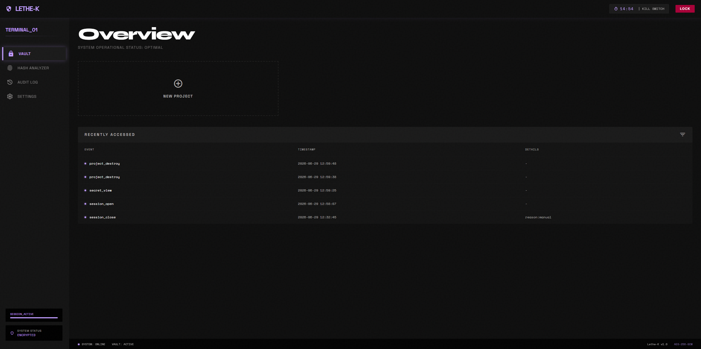
</a>

<br>
<b>Overview</b>

</td>
</tr>

<tr>
<td width="50%" align="center">

<a href="assets/new_project.png">
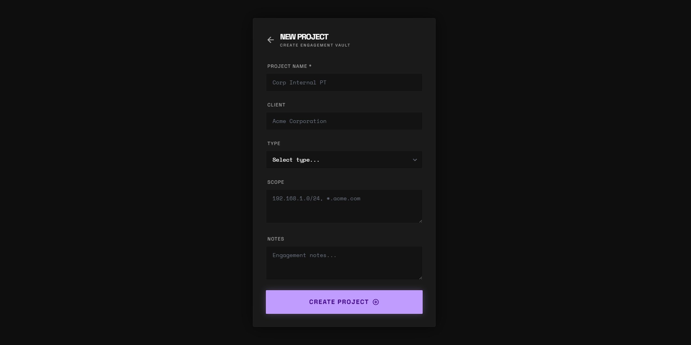
</a>

<br>
<b>New Project</b>

</td>

<td width="50%" align="center">

<a href="assets/project.png">
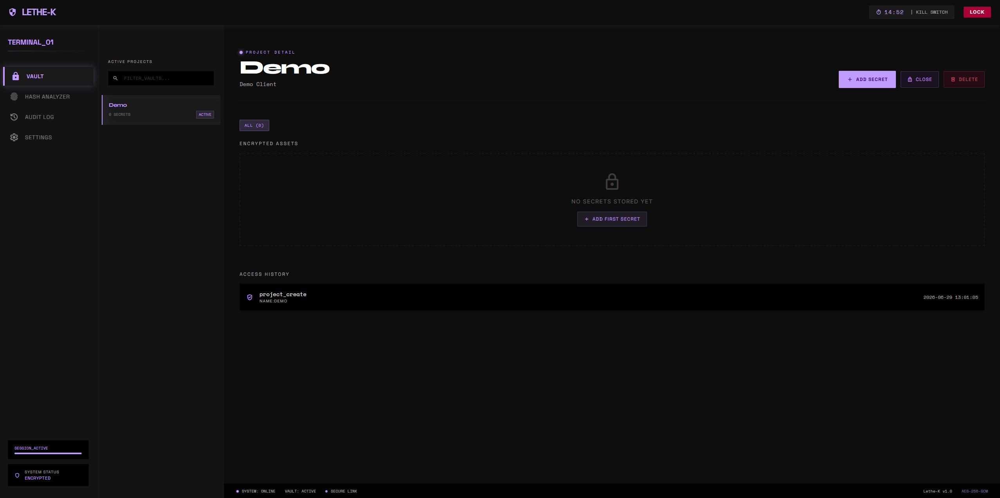
</a>

<br>
<b>Project View</b>

</td>
</tr>

<tr>
<td width="50%" align="center">

<a href="assets/secret.png">
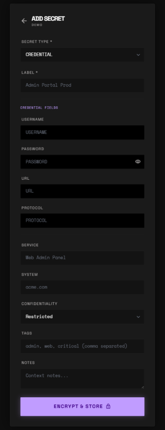
</a>

<br>
<b>Secret List</b>

</td>

<td width="50%" align="center">

<a href="assets/project_secret.png">
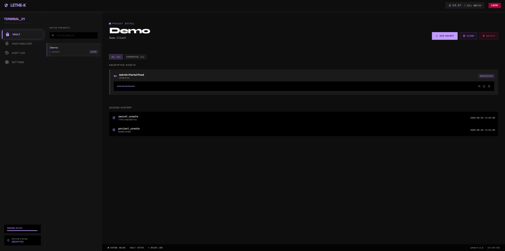
</a>

<br>
<b>Project Detail</b>

</td>
</tr>

<tr>
<td width="50%" align="center">

<a href="assets/secret_detail.png">
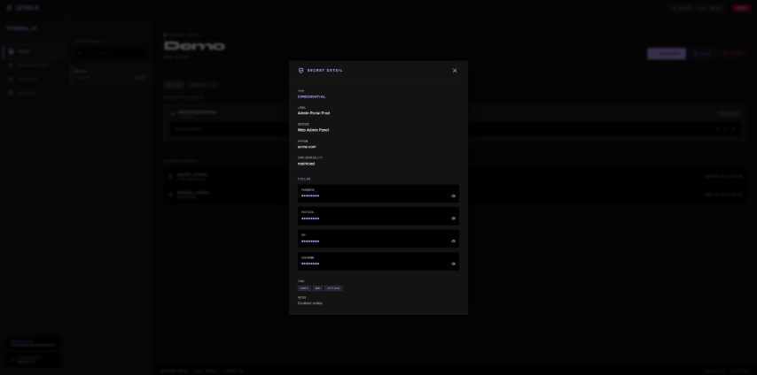
</a>

<br>
<b>Secret Detail</b>

</td>

<td width="50%" align="center">

<a href="assets/hash_analyzer.png">
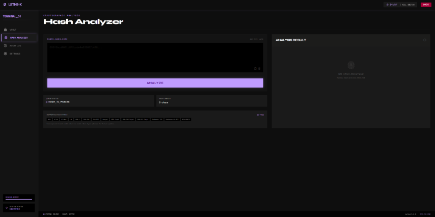
</a>

<br>
<b>Hash Analyzer</b>

</td>
</tr>

<tr>
<td width="50%" align="center">

<a href="assets/audit_log.png">
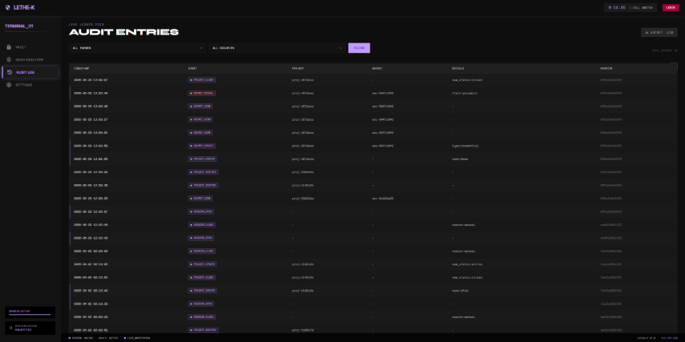
</a>

<br>
<b>Audit Log</b>

</td>

<td width="50%" align="center">

<a href="assets/settings.png">
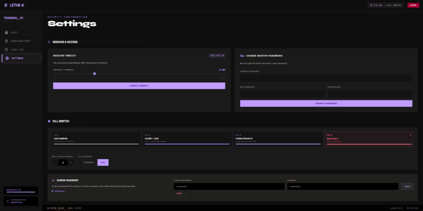
</a>

<br>
<b>Settings</b>

</td>
</tr>

<tr>
<td width="50%" align="center">

<a href="assets/settings_dangerzone.png">
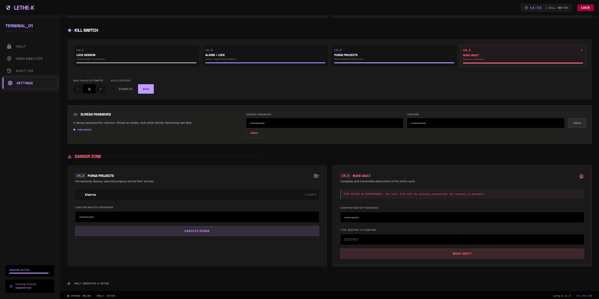
</a>

<br>
<b>Danger Zone</b>

</td>

<td></td>
</tr>

</table>

</details>

---

## Architecture

The core module has no dependency on the UI or CLI layers. All sensitive logic lives in `core/` and both interfaces call the same underlying module — security behavior is identical regardless of access method.

```
Lethe-K/
├── core/                          # Central logic — no UI dependency
│   ├── vault.py                   # Vault open / close / integrity check
│   ├── crypto.py                  # AES-256-GCM, PBKDF2, secure erase
│   ├── secrets.py                 # Secret and project CRUD
│   ├── audit.py                   # Immutable audit log
│   ├── killswitch.py              # Four-level destruction logic
│   ├── clipboard.py               # Clipboard manager with auto-clear
│   └── session.py                 # In-memory session management
├── ui/
│   ├── app.py                     # Flask dashboard
│   ├── templates/                 # Per-screen HTML templates
│   └── static/                   # CSS and minimal JS
├── cli/
│   └── main.py                    # CLI entry point
└── data/
    ├── vault.db                   # AES-256-GCM encrypted SQLite vault
    ├── vault.salt                 # Cryptographic salt, stored separately
    └── audit.log                  # Encrypted audit log
```

---

## Secret Types

Lethe-K treats every secret type differently. Each has specific fields relevant to its use in a pentest engagement, not a generic key-value store.

| Type | Fields | Use case |
|---|---|---|
| **Credential** | Username, password, service, URL, protocol | Compromised web or system accounts |
| **Hash** | Algorithm (auto-detected), hash value, crack status, resulting password, source system | Password hashes extracted from databases or memory dumps |
| **Token** | Value, type (JWT / API key / session / OAuth), expiry, scope | Session tokens, API keys, OAuth tokens |
| **SSH Key** | Private key, username, host, passphrase | SSH private keys found on compromised systems |
| **Certificate** | Certificate, private key, associated domain | TLS private keys from compromised servers |
| **Database** | Host, port, database name, username, password, engine type | Direct database access credentials |
| **Network** | Host, credentials, device type | Network device and VPN credentials |
| **Secure Note** | Free text | Sensitive unstructured notes |
| **Custom** | User-defined fields | Any case not covered by the above |

All types share a common base: project, source system, discovery date, custom tags, confidentiality level (internal / restricted / confidential), and free notes.

---

## Kill Switch

The kill switch is the most distinctive feature of Lethe-K. Four escalating levels of response, each appropriate to a different threat scenario.

| Level | Name | Behavior |
|---|---|---|
| **1** | Lock | Closes the session immediately. Requires master password to re-enter. No data destruction. |
| **2** | Alarm | Triggered after N consecutive failed access attempts. Progressive lockout with full audit logging. |
| **3** | Purge | Secure deletion of selected project data. Remaining vault intact. Requires master password confirmation. |
| **4** | Total Destruction | Multi-pass overwrite of the vault file followed by deletion. Irreversible. Can be triggered manually, by maximum failed attempts, or via duress password. |

### Duress Password

A second password configured separately from the master password. If someone forces the user to unlock Lethe-K under coercion, entering the duress password instead of the real one causes the application to appear to open normally — displaying an empty vault — while silently initiating Level 4 destruction of the real vault in the background. The attacker sees a functional-looking interface while the actual data is being permanently erased.

### Secure Erase

Standard file deletion leaves data recoverable with forensic tools — the OS only marks the space as available. Lethe-K's secure erase overwrites the vault file with random data multiple times before deletion, making forensic recovery impractical.

---

## Key Features

### Engagement Organization
Each project in Lethe-K represents a complete engagement. Secrets from different clients are never mixed. Projects move through a defined lifecycle: `Active → Closed → Archived → Destroyed`. Archived projects require explicit confirmation to access, preventing accidental exposure of past client data.

### Masked Fields
All secret values are displayed as `●●●●●●●●` by default throughout the interface. The detail view reveals fields individually on demand — there is no "show all" button. Every individual field reveal is logged in the audit trail.

### Clipboard Security
Copying a secret to the clipboard starts a visible countdown timer. After 30 seconds (configurable), the clipboard content is automatically cleared. The copy event and the clear event are both recorded in the audit log.

### Hash Analyzer
Dedicated module for managing password hashes found during an engagement. Auto-detects the hash algorithm, tracks crack status, stores the resulting plaintext password once obtained, and generates the corresponding Hashcat or John the Ripper command for external cracking. Lethe-K manages the hash lifecycle — the actual cracking is delegated to dedicated GPU tools.

### Immutable Audit Log
Every operation is logged with a timestamp and session ID: logins, failed attempts, secret views, clipboard copies, creates, edits, deletions, exports, and kill switch activations. The log is encrypted with the same master key as the vault. It is append-only from the UI — no editing or deletion is possible. Exportable as signed PDF or plaintext for client delivery.

### CLI Access
Full command-line interface for use during active engagements without switching context.

```bash
lethek unlock                          # Unlock session (password prompted interactively)
lethek list --project <id>             # List secrets in a project
lethek get <id>                        # Display secret for 10 seconds, then clear
lethek copy <id>                       # Copy to clipboard with auto-clear
lethek add --type credential           # Add secret interactively
lethek kill --level 4                  # Trigger kill switch at specified level
lethek audit --project <id>            # View audit log
```

Secret values never appear in shell history. Master password is always prompted interactively, never passed as a command argument.

---

## Security Design

| Layer | Implementation |
|---|---|
| Database encryption | AES-256-GCM on the full SQLite vault file |
| Field-level encryption | Individual secret values encrypted before database storage (second layer) |
| Key derivation | PBKDF2 with random salt, 600,000 iterations — deliberately slow against brute force |
| Salt storage | Stored separately from the encrypted database |
| Master password | Never stored — used to mathematically derive the encryption key |
| Session management | Active session exists in memory only, never written to disk |
| No password recovery | No recovery mechanism by design — any recovery path is a potential attack vector |
| Vault integrity | Integrity check on every launch to detect external tampering |
| Audit log | Encrypted, append-only, destroyed with vault on Level 4 activation |
| No cloud dependencies | No telemetry, no sync, no external requests |

---

## Tech Stack

| Component | Technology |
|---|---|
| Language | Python 3.11+ |
| Web UI | Flask |
| Database | SQLite + AES-256-GCM (custom encryption layer) |
| Key derivation | PBKDF2 (cryptography library) |
| CLI | argparse + getpass |
| Platform | Windows + Linux |

---

## Ecosystem

Lethe-K is part of a personal cybersecurity toolkit and integrates with:

- **[Vanta-G](../Vanta-G)** — vulnerability management system. Vanta-G stores only the Lethe-K internal secret ID when referencing a compromised credential — the actual value never leaves the Lethe-K vault.
- **[Wraith-Rotator](../Wraith-Rotator)** — ProtonVPN IP rotation tool. Engagement metadata in Lethe-K can reference the source IP used during a session.

---

## Why Not an Existing Tool

| Tool | What it does well | What it lacks for pentesting |
|---|---|---|
| **Bitwarden** | Personal password management, cross-platform, open source | No engagement organization, no kill switch, no pentest-specific secret types, requires server or cloud |
| **KeePass** | Local, solid encryption, free | No self-destruction, no security-oriented audit trail, not built for pentest workflow |
| **Pass (Unix)** | Minimalist, GPG-based, native CLI | No project organization, no secret types, no kill switch, requires GPG setup |
| **Plain text / notes** | Fast, no friction | No encryption, no organization, no audit trail, secrets on disk in plaintext |

---

## Development Phases

| Phase | Scope | Status |
|---|---|---|
| 1 — Crypto Core | AES-256-GCM · PBKDF2 · Secure erase · Vault open/close | ✅ Complete |
| 2 — Secrets & Projects | Full CRUD for all 9 secret types · Immutable audit log | ✅ Complete |
| 3 — Kill Switch | Four-level destruction · Duress password · Brute-force lockout | ✅ Complete |
| 4 — CLI | Full command set · Clipboard auto-clear · No history exposure | ✅ Complete |
| 5 — Web UI | Flask dashboard · Masked fields · Session timer · Danger Zone settings | ✅ Complete |
| 6 — Future | Hashcat/John launcher integration · Vanta-G cross-reference | 🔵 Planned |

308 tests across all modules.

---

## License

Non-commercial use only. See [LICENSE](LICENSE) for terms.

---

<div align="center">
  <sub>Built by <a href="https://github.com/EnrikeRoe">EnrikeRoe</a> · Part of the Kronos-Z ecosystem</sub>
</div>
